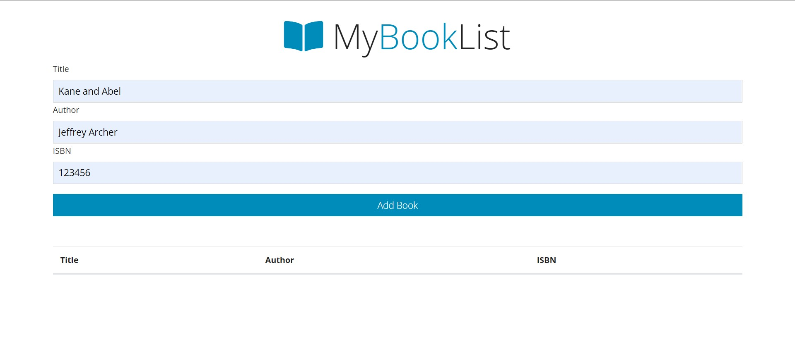
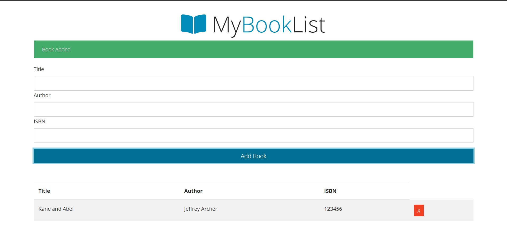
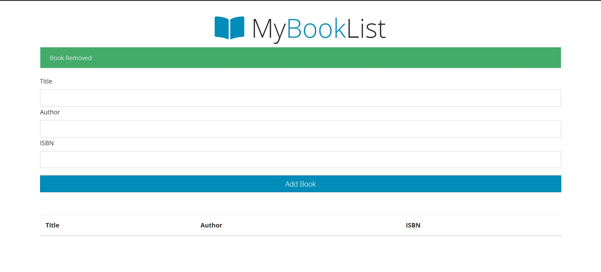
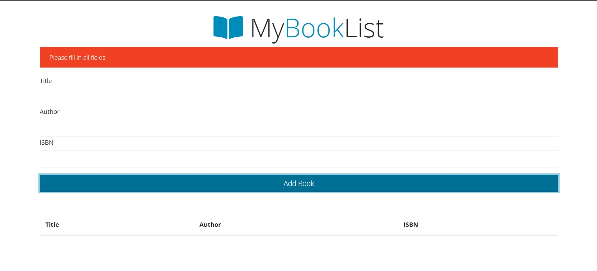

# booklist-app
A simple Vanilla JS application built using the browser's local storage.

## Tech stack

- HTML
- CSS
- JS
- FontAwesome
- Bootswatch (yeti theme)
- Local storage of the browser

## Screenshots

Add book (pre-click)

Add book (post-click)

Delete book

Error message
